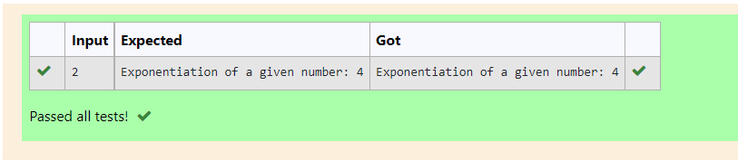

# Find the exponentiation of a number

## AIM:
To write a program to find the exponentiation of a number.

## Equipments Required:
1. Hardware – PCs
2. Anaconda – Python 3.7 Installation / Moodle-Code Runner

## Algorithm:
### Step 1:
1. Get the input from the user.
### Step 2:
2. Use exponentiation operator to find the exponentiation of a number.
### Step 3:
3. Print and end the program.

## Program:
```
#Program to to find the Exponentiation of a number.
#Developed by: Vaishnavi M 
#RegisterNumber: 21500310
def exp(x):
    for i in range(1):
        x=x**2
        print("Exponentiation of a given number:",x)
x=int(input())
exp(x)
```

## Output:



## Result:
Thus the program to find the exponentiation of a given number is written and verified using python programming.
